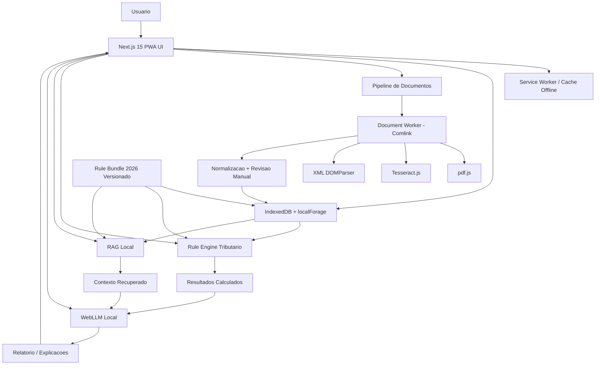
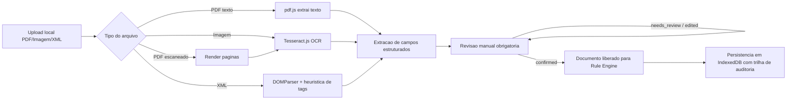
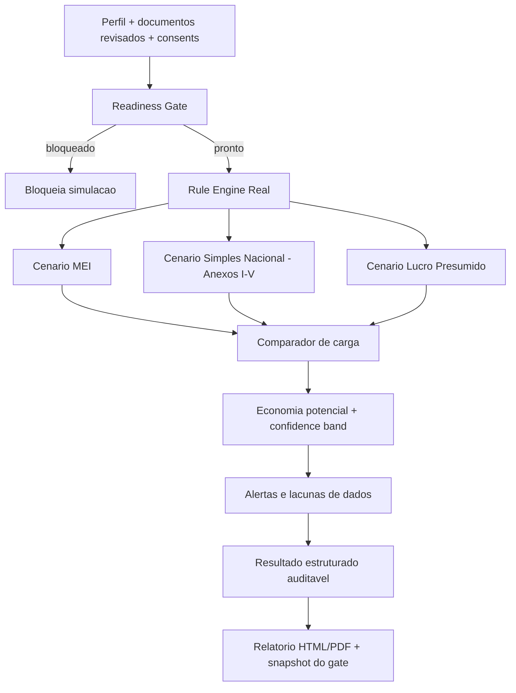

# EconomizaIA Local — Arquitetura

## 1. Resumo executivo

O **EconomizaIA Local** e uma **PWA 100% local-first e offline-first**, voltada para **MEIs, freelancers, autonomos e microempresas**, com o objetivo de **identificar oportunidades legais e conservadoras de economia tributaria** no contexto da **Reforma Tributaria brasileira (IBS/CBS 2026/2027 e transicao 2026–2033)**.

### Principios inegociaveis
- **Zero backend de dados do usuario**: nenhum dado fiscal ou documento sobe para servidor.
- **Rule engine acima do LLM**: o motor de regras calcula; o LLM apenas explica.
- **Arquitetura auditavel**: toda sugestao deve trazer premissas, regras aplicadas e trilha reproduzivel.
- **Conservadorismo regulatorio**: na duvida, hipotese conservadora + recomendacao de validacao com contador.
- **UX de confianca**: sem promessas magicas; com clareza, limites e disclaimers.

### Macroarquitetura
1. **Apresentacao**: Next.js 15 + PWA + shadcn/ui
2. **Persistencia local**: IndexedDB + localForage
3. **Extracao documental local**: pdf.js + Tesseract.js + Web Workers + Comlink
4. **Normalizacao fiscal**: entidades tributarias estruturadas
5. **Motor tributario rule-based** (real-tax-rule-engine: MEI, Simples Nacional, Lucro Presumido)
6. **RAG local**: Transformers.js + normative-chunks
7. **LLM local**: WebLLM (Phi-3.5-mini) com politica anti-alucinacao

## 2. Diagramas Mermaid

### 2.1 Arquitetura de alto nivel


### 2.2 Fluxo documental


### 2.3 Fluxo decisorio com readiness gate


## 3. Stack detalhada

| Camada | Tecnologia | Papel |
|--------|-----------|-------|
| App shell | Next.js 15 (App Router) + React 19 | Roteamento, SSG, PWA |
| UI | Tailwind + shadcn/ui | Interface sobria e acessivel |
| Tipagem | TypeScript (98%+) | Dominio tributario tipado |
| Persistencia | IndexedDB + localForage | Dados 100% locais |
| PDF | pdfjs-dist | Extracao de texto de PDFs digitais |
| OCR | Tesseract.js v6 | Fallback para PDFs escaneados/imagens |
| Workers | Web Workers + Comlink | Processamento isolado da UI thread |
| Rule engine | TypeScript puro | MEI, Simples (Anexos I-V), Lucro Presumido |
| RAG | Transformers.js | Embeddings e retrieval local |
| LLM | @mlc-ai/web-llm (Phi-3.5-mini) | Explicacao local via WebGPU |
| PDF export | pdfmake | Relatorio PDF local |
| PWA | next-pwa | Service Worker e cache offline |

## 4. Camadas de seguranca

### Readiness gate (`lib/manual-first-readiness.ts`)
Bloqueia a simulacao quando:
- Consents nao aceitos (local-only + mock awareness)
- Campos criticos vazios
- Documentos nao revisados (modo documental)
- Bundle fora da politica review_required
- Confianca baixa com lacunas criticas

### Operational readiness (`lib/operational-readiness.ts`)
Score de confiabilidade operacional (fragil / demonstravel / confiavel) baseado em:
- Snapshots locais salvos
- Trilha de auditoria disponivel
- Relatorio alinhado com simulacao vigente
- Estado documental coerente

### Anti-alucinacao do LLM (`lib/web-llm.ts`)
- LLM recebe apenas dados estruturados do motor + RAG local
- Nunca inventa aliquotas, regras ou orientacao fiscal
- Recusa controlada quando faltam evidencias
- Prompt contract versionado

## 5. Stores IndexedDB

| Store | Conteudo |
|-------|----------|
| `anonymous_onboarding` | Perfil anonimo do usuario |
| `taxpayer_profiles` | Perfil fiscal derivado |
| `ingestion_documents` | Documentos ingeridos com revisao manual |
| `documents` | Documentos fiscais estruturados |
| `simulations` | Resultados de simulacao |
| `simulation_results` | Resultados detalhados |
| `rule_bundles` | Bundles de regras versionados |
| `user_reports` | Relatorios gerados |
| `audit_events` | Trilha de auditoria |
| `snapshots` | Snapshots locais para demonstrabilidade |

## 6. Rule Engine

### Motor real (`engine/real-tax-rule-engine.ts`)
- **MEI**: DAS = 5% salario minimo + ICMS/ISS. Limite R$ 81.000/ano
- **Simples Nacional**: Anexos I-V com aliquotas efetivas por faixa. Fator R para servicos (28% = Anexo III vs V)
- **Lucro Presumido**: IRPJ 15% + adicional, CSLL 9%, PIS 0,65%, COFINS 3%, ISS ~3%
- Classificacao de atividade por heuristica de palavras-chave (default conservador: servicos)

### Rule Bundle (`engine/real-rule-bundle.ts`)
- Status: `bundleStatus: "review_required"`, todas as regras `status: "draft"`
- Citacoes legais: LC 123/2006, CGSN 140/2018, RIR/2018
- Valores de referencia 2026: salario minimo R$ 1.518,00

## 7. Pipeline documental

```
Upload (PDF/XML/Imagem)
  -> registerDocumentLocally() — cria registro no IndexedDB
  -> processDocumentWithDedicatedWorker() — Comlink Web Worker
     -> Classificacao de tipo
     -> Extracao de texto (pdf.js / DOMParser / OCR Tesseract)
     -> Extracao de campos estruturados (CNPJ, data, valor, numero)
     -> Normalizacao de revisao manual (estados por campo)
  -> Revisao manual obrigatoria (campo a campo com historico)
  -> Confirmacao libera documento para rule engine
```
