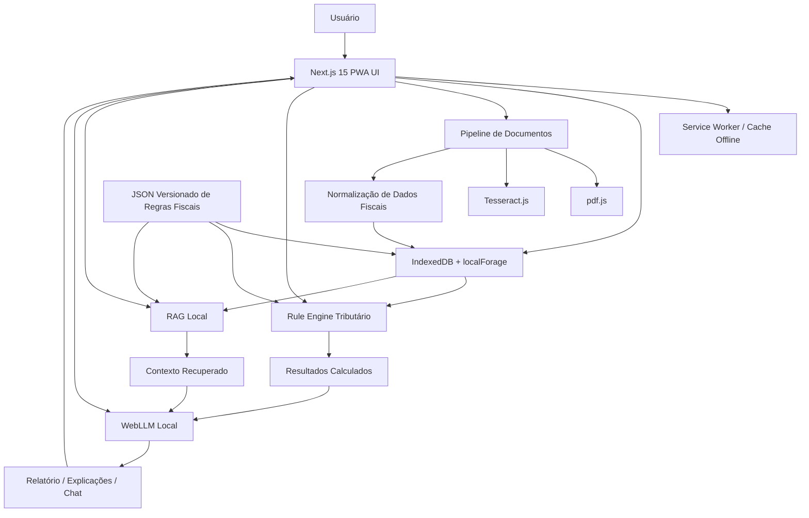
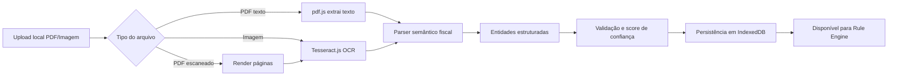
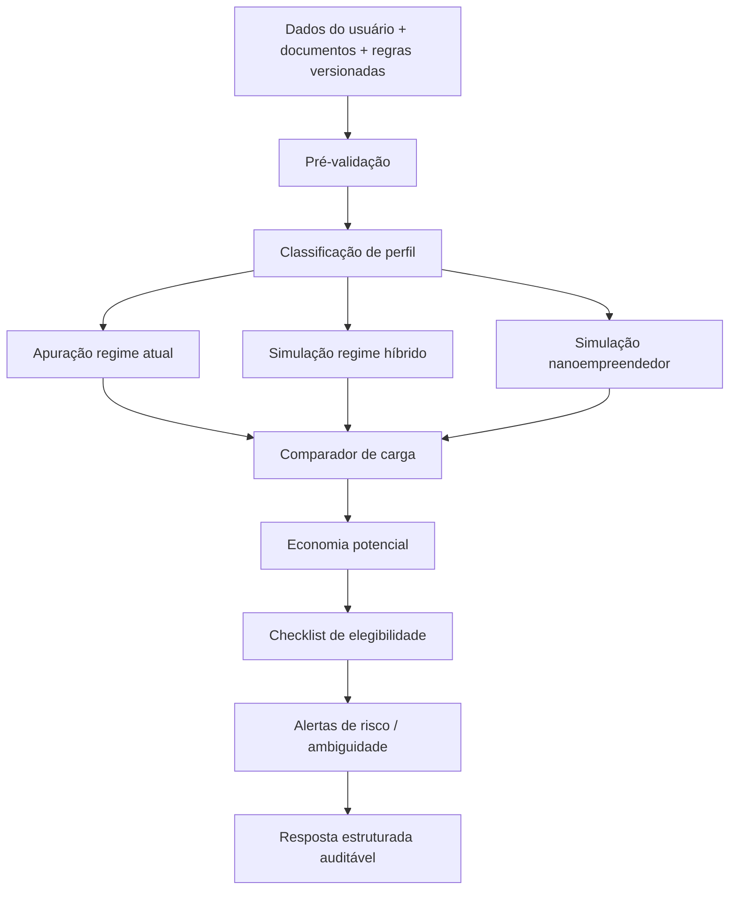

# EconomizaIA Local — Arquitetura

## 1. Resumo executivo

O **EconomizaIA Local** é uma **PWA 100% local-first e offline-first**, voltada para **MEIs, freelancers, autônomos e microempresas**, com o objetivo de **identificar oportunidades legais e conservadoras de economia tributária** no contexto da **Reforma Tributária brasileira (IBS/CBS 2026/2027 e transição 2026–2033)**.

### Princípios inegociáveis
- **Zero backend de dados do usuário**: nenhum dado fiscal ou documento sobe para servidor.
- **Rule engine acima do LLM**: o motor de regras calcula; o LLM apenas explica.
- **Arquitetura auditável**: toda sugestão deve trazer premissas, regras aplicadas e trilha reproduzível.
- **Conservadorismo regulatório**: na dúvida, hipótese conservadora + recomendação de validação com contador.
- **UX de confiança**: sem promessas mágicas; com clareza, limites e disclaimers.

### Macroarquitetura
1. **Apresentação**: Next.js 15 + PWA + shadcn/ui
2. **Persistência local**: IndexedDB + localForage
3. **Extração documental local**: pdf.js + Tesseract.js + Web Workers
4. **Normalização fiscal**: entidades tributárias estruturadas
5. **Motor tributário rule-based**
6. **RAG local**: Transformers.js
7. **LLM local**: WebLLM (Phi-3.5-mini ou Llama 3.2 3B)

## 2. Diagramas Mermaid

### 2.1 Arquitetura de alto nível


### 2.2 Fluxo documental


### 2.3 Fluxo decisório


## 3. Stack detalhada + justificativa
- **Next.js 15**: shell do app, roteamento, build estático, PWA.
- **TypeScript**: tipagem forte para domínio tributário.
- **Tailwind + shadcn/ui**: UI sóbria, consistente e rápida de iterar.
- **IndexedDB + localForage**: persistência robusta local.
- **pdf.js + Tesseract.js**: extração documental local.
- **Web Workers**: isolamento de OCR, embeddings e parsing.
- **WebLLM**: explicação local via WebGPU.
- **Transformers.js**: embeddings e retrieval local.
- **Vercel estático**: distribuição do shell sem backend de dados.

## 4. Schema IndexedDB + exemplo de JSON fiscal

### Stores sugeridas
- `documents`
- `document_pages`
- `ocr_jobs`
- `extractions`
- `taxpayer_profiles`
- `simulations`
- `analysis_results`
- `rule_bundles`
- `normative_sources`
- `embeddings`
- `reports`
- `audit_logs`
- `app_settings`

### Exemplo simplificado de regra fiscal 2026
```json
{
  "bundleVersion": "2026.1.0",
  "generatedAt": "2026-01-10T00:00:00-03:00",
  "jurisdiction": "BR",
  "sources": [
    {
      "id": "lc_reforma_xxx",
      "type": "lei_complementar",
      "title": "Lei Complementar da Reforma Tributária",
      "url": "https://www.planalto.gov.br/...",
      "hash": "sha256-abc123",
      "effectiveFrom": "2026-01-01",
      "effectiveTo": null,
      "status": "vigente"
    }
  ],
  "rules": [
    {
      "id": "ibs_cbs_servicos_basico_v1",
      "kind": "rate_rule",
      "subject": "prestacao_servicos",
      "regime": "geral",
      "effectiveFrom": "2026-01-01",
      "effectiveTo": null,
      "status": "vigente",
      "confidence": "medium",
      "calculation": {
        "base": "gross_revenue",
        "rate": 0.0,
        "formula": "gross_revenue * applicable_rate"
      },
      "requires": ["competencia", "atividade", "receita_bruta"],
      "citations": [
        {
          "sourceId": "lc_reforma_xxx",
          "article": "art. 12",
          "excerpt": "Trecho normativo relevante..."
        }
      ],
      "fallbackPolicy": "se faltar dado relevante, não fechar cálculo"
    }
  ]
}
```

## 5. Fluxos de usuário + wireframes em texto

### Fluxo principal
1. Boas-vindas anônimas
2. Seleção de perfil (MEI, freelancer, autônomo, microempresa)
3. Upload ou entrada manual mínima
4. Extração local e revisão de dados
5. Simulação e comparação de cenários
6. Relatório explicativo
7. Salvamento local / exportação PDF

### Wireframes resumidos
- **Home**: proposta de valor + CTA + privacidade
- **Onboarding**: perguntas mínimas
- **Upload**: arrastar arquivos + status de OCR
- **Dashboard**: cards de cenários, confiança e economia potencial
- **Resultado**: números, premissas, fontes, alertas
- **Chat explicativo**: perguntas sobre o resultado, não sobre “inventar regra”

## 6. Implementação detalhada

### Rule engine
- Funções TypeScript puras
- Entrada estruturada e validada
- Regras por vigência, jurisdição, regime e atividade
- Saída auditável com:
  - resultado numérico
  - regras aplicadas
  - premissas
  - faltas de dados
  - confidence band

### LLM local
- Recebe apenas saída estruturada do motor + contexto do RAG
- Nunca decide imposto
- Nunca cria interpretação nova
- Deve assumir insuficiência quando faltarem dados

### Prompting seguro
- Sem chain-of-thought exposto ao usuário
- Prompt com restrições explícitas:
  - “Você não calcula impostos”
  - “Você apenas explica o resultado do motor”
  - “Se confidence for baixa, não seja categórico”
  - “Se faltar base normativa, declare isso”

## 7. Otimização de performance
- lazy loading de OCR e LLM
- workers para tarefas pesadas
- processamento progressivo por página
- fallback sem WebGPU
- compressão e particionamento de rule bundles
- só baixar modelo local quando necessário

## 8. UI/UX
Mensagens obrigatórias:
- **Cálculo baseado na lei oficial e nas premissas informadas**
- **IA local usada apenas para explicar os resultados**
- **Não substitui contador**
- **Seus dados não saem deste dispositivo**

## 9. Estratégia de monetização
- Freemium local
- Licença premium individual
- Atualizações normativas por exercício
- Licença pro local para escritórios e contadores

## 10. Roadmap de 3 meses + esforço estimado

### Mês 1
- setup Next.js/PWA
- schema local
- pipeline de upload
- OCR/PDF base
- primeira versão do rule engine

### Mês 2
- comparação de cenários
- auditoria local
- RAG local
- relatório PDF
- UX de confiança e disclaimers

### Mês 3
- chat explicativo local
- otimizações mobile
- versionamento de pacotes normativos
- testes de regressão fiscal
- hardening offline

### Estimativa
- MVP funcional: **8 a 12 semanas**
- Time ideal mínimo:
  - 1 tech lead/full-stack
  - 1 frontend
  - 1 especialista fiscal/regra
  - 1 produto/design part-time
